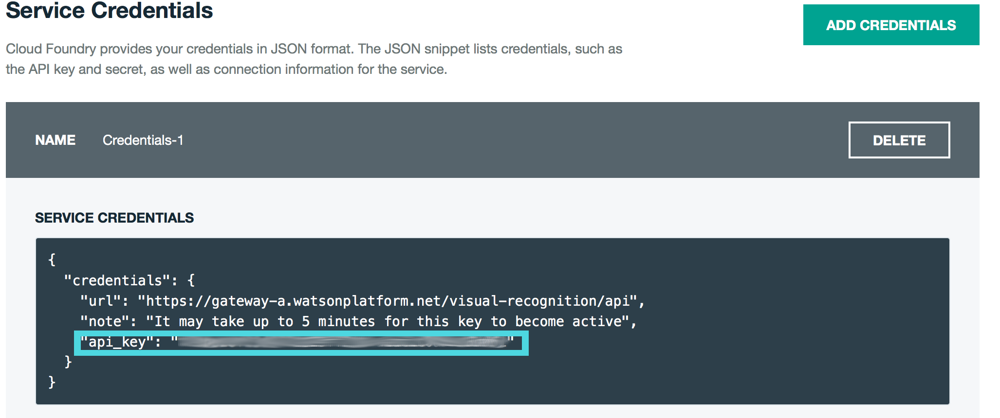
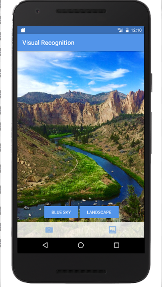
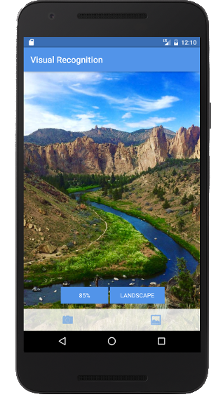

## Visual Recognition
Bluemix Mobile Starter for Visual Recognition in Java

[](https://bluemix.net)
[](https://developer.android.com/index.html)

### Table of Contents
* [Summary](#summary)
* [Requirements](#requirements)
* [Configuration](#configuration)
* [Run](#run)
* [License](#license)

### Summary
The Bluemix Mobile Starter for Watson Visual Recognition showcases the Visual Recognition service from Watson and gives you integration points for each of the Bluemix Mobile services.

### Requirements
* A [Bluemix](http://bluemix.net) Account
* [Android Studio](https://developer.android.com/studio/index.html) and [Gradle](https://gradle.org/gradle-download/)
* A [Visual Recognition](https://console.ng.bluemix.net/catalog/services/visual-recognition/) service instance obtained from the [Bluemix Catalog](https://console.ng.bluemix.net/catalog/)

### Configuration
* Open the project in Android Studio and perform a Gradle Sync.
* Navigate to `res/values/watson_credentials.xml` and input your Visual Recognition Service API Key.

```HTML
<resources>
    <string name="visualRecognitionAPIKey">xxxxxxxxxxxxxxxxxxxxxxxxxxxxxxxxxxxxxxxx</string>
</resources>
```

To obtain your API Key, navigate to your `Service Credentials` tab in your Visual Recognition Service Dashboard:




### Run
* You can now build and run the application from Android Studio!

 

The application allows you to perform Visual Recognition on user-selected images. You can take a photo from the application or select a photo from your gallery to start the Visual Recognition process. Tap the Tags to see the certainty score for the image.

### License
This package contains code licensed under the Apache License, Version 2.0 (the "License"). You may obtain a copy of the License at http://www.apache.org/licenses/LICENSE-2.0 and may also view the License in the LICENSE file within this package.
